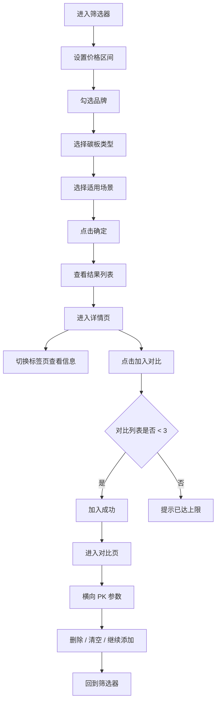

# 跑鞋筛选与对比产品需求文档（PRD）

## 1. 产品概述
为跑步爱好者打造的"跑鞋筛选 · 详情查看 · PK 对比"一站式工具，帮助用户根据预算、品牌、碳板配置与适用场景精准挑选跑鞋，并通过多维度 PK 辅助决策。
目标用户：业余跑者、进阶跑者、备赛马拉松选手；核心价值：把复杂的跑鞋参数（碳板 / 落差 / 缓震级别 / 重量）转化为可视化、易对比的消费决策。

## 2. 核心功能

### 2.1 角色说明
本产品无需登录注册，所有用户使用相同功能。

### 2.2 功能模块
1. **筛选器页（首页）**：价格区间、品牌分组、碳板类型、适用场景四类筛选条件，支持重置与确定。
2. **列表/结果页**：根据筛选条件展示符合条件的跑鞋，列表卡片支持"加入对比 / 查看详情"。
3. **详情页**：功能科技 / 参数详情 / 跑者感受三标签页，头部与底部均有"加入对比"按钮。
4. **对比页**：最多 3 款跑鞋并排对比价格、重量、鞋底落差、缓震级别、碳板、适用场景，自动标记最优项，支持删除与清空。

### 2.3 页面详情
| 页面 | 模块 | 功能说明 |
|------|------|----------|
| 筛选器 | 价格区间 | 双滑块控制最低价 / 最高价，预算精准控制 |
| 筛选器 | 品牌分组 | "热门品牌"+"其他品牌"两组网格按钮，多选 |
| 筛选器 | 碳板类型 | "带碳板 / 无碳板"二选一网格按钮 |
| 筛选器 | 适用场景 | 6 种场景（日常训练 / 长距离 / 速度训练 / 比赛竞速 / 越野 / 慢跑恢复）网格按钮 |
| 筛选器 | 底部操作 | "重置"清空所有条件，"确定"按钮显示符合条件跑鞋数量 |
| 详情页 | 标签页 | "功能科技 / 参数详情 / 跑者感受"三标签切换 |
| 详情页 | 功能科技 | 碳板、缓震级别、重量、鞋底落差、核心科技、适用场景 |
| 详情页 | 参数详情 | 条目化展示品牌、重量、落差、缓震、碳板、价格 |
| 详情页 | 跑者感受 | 模拟用户评价：回弹性 / 稳定性 / 透气性 / 抓地力 / 耐磨性 + 认可率 |
| 详情页 | PK 按钮 | 头部与底部双位置"加入对比" |
| 对比页 | 卡片对比 | 最多 3 款，每列展示一款跑鞋 |
| 对比页 | 参数对比 | 价格、重量、鞋底落差、缓震级别、碳板、适用场景 |
| 对比页 | 最优标识 | 自动高亮"最低价 / 最轻重量 / 有碳板" |
| 对比页 | 对比管理 | 删除单款 / 清空对比 / 继续添加 |

## 3. 核心流程
用户在筛选器选择预算、品牌、碳板、场景 → 点击"确定"查看结果 → 进入详情页查看具体参数与评价 → 加入对比（最多 3 款） → 进入对比页横向 PK → 可继续筛选或清空重新选择。

## 4. 用户界面设计

### 4.1 设计风格
- **主色调**：深色基底（`#0B0B0F` 接近黑）+ 荧光荧光绿强调色（`#C6FF3D` 跑步活力感）+ 中性灰（`#A1A1AA`）
- **辅助色**：警示橙 `#FF6B35`、警告红 `#FF4D4F`、成功绿 `#22C55E`
- **按钮风格**：圆角 12px 实心按钮 + 描边按钮混排；选中态使用荧光绿高亮 + 微阴影
- **字体**：标题用 `Space Grotesk`（带运动机械感），正文用 `Inter`，数字价格用等宽字体 `JetBrains Mono`
- **布局**：卡片化，桌面端左右分栏（左侧筛选条件 360px 固定，右侧结果区滚动）；移动端单列堆叠 + 底部抽屉
- **图标**：使用 lucide-react（zap、shield、wind、mountain、timer、feather 等）

### 4.2 页面设计概述
| 页面 | 模块 | UI 元素 |
|------|------|---------|
| 筛选器 | 价格区间 | 双滑块条 + 数值输入框同步；刻度显示 500/1000/1500/2000+ |
| 筛选器 | 品牌分组 | "热门品牌"为带品牌 Logo 占位的网格（4 列）；"其他品牌"为简洁文字按钮（4 列） |
| 筛选器 | 碳板类型 | 2 列大按钮，带图标（`Zap` vs `Minus`） |
| 筛选器 | 适用场景 | 3 列网格，每项带图标 + 名称（日常训练 / 长距离 / 速度训练 / 比赛竞速 / 越野 / 慢跑恢复） |
| 筛选器 | 底部操作 | 粘性底部栏，左"重置"（描边），右"确定（X 款）"（荧光绿实心） |
| 详情页 | 头部 | 大图 + 品牌徽章 + 名称 + 价格 + 右上角"加入对比"按钮 |
| 详情页 | 标签 | 横向 Tabs，下划线指示器，激活时荧光绿 |
| 详情页 | 跑者感受 | 维度进度条 + 百分比认可率，附带 2 条模拟评价 |
| 对比页 | 卡片列 | 每列顶部为鞋款图 + 名称 + 删除按钮；中部为参数对比行；最优项打 `Best` 徽章 |

### 4.3 响应式
- 桌面优先（≥1280px）：双栏布局
- 平板（768–1279px）：筛选器抽屉化
- 移动端（<768px）：单列堆叠，底部抽屉式筛选，详情页标签页横滑

### 4.4 3D 场景说明
本产品无 3D 场景需求。
