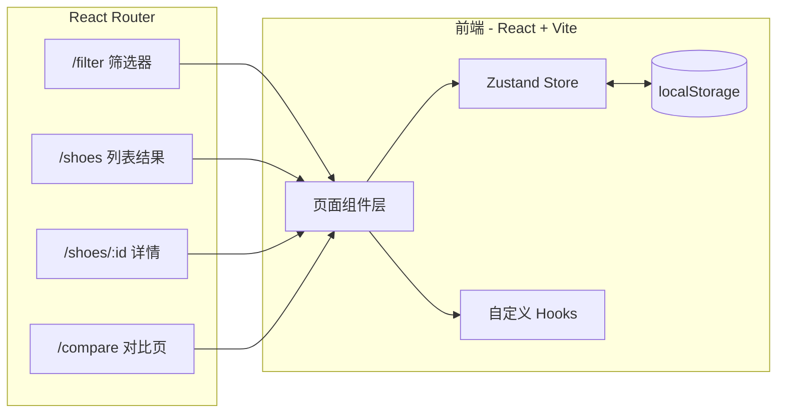

# 技术架构文档

## 1. 架构设计



## 2. 技术栈说明
- **前端**：React@18 + TypeScript + Vite + TailwindCSS@3 + Zustand
- **路由**：react-router-dom@6
- **图标**：lucide-react
- **初始化模板**：`react-ts`（纯前端，mock 数据 + localStorage 持久化对比列表）
- **后端**：无（mock 数据内嵌在 `src/data/shoes.ts`）
- **数据库**：无

## 3. 路由定义
| 路由 | 用途 |
|------|------|
| `/filter` | 筛选器页（首页入口） |
| `/shoes` | 筛选结果列表页 |
| `/shoes/:id` | 跑鞋详情页（三标签页） |
| `/compare` | 对比页（最多 3 款） |
| `/` | 重定向到 `/filter` |

## 4. 数据模型

### 4.1 跑鞋数据结构
```ts
type CarbonPlate = 'with' | 'without';
type Scene = 'daily' | 'long' | 'speed' | 'race' | 'trail' | 'recovery';

interface Shoe {
  id: string;
  brand: string;
  brandHot: boolean;          // 是否热门品牌
  name: string;
  price: number;              // 单位：元
  weight: number;             // 单位：克
  drop: number;               // 鞋底落差 mm
  cushion: 'low' | 'medium' | 'high'; // 缓震级别
  carbon: CarbonPlate;        // 是否带碳板
  scenes: Scene[];            // 适用场景
  tech: string[];             // 核心科技标签
  image: string;              // 鞋款图
  color: string;              // 鞋款主色（占位）
}
```

### 4.2 跑者感受结构
```ts
interface RunnerReview {
  rebound: number;        // 回弹 0-100 认可率
  stability: number;      // 稳定
  breathability: number;  // 透气
  grip: number;           // 抓地
  durability: number;     // 耐磨
  comments: string[];     // 2 条模拟评价
}
```

### 4.3 对比列表结构
```ts
// Zustand store，持久化到 localStorage key="runner-compare"
interface CompareState {
  ids: string[];          // 最多 3 个
  add: (id: string) => boolean;  // 返回是否成功（已存在/已满则 false）
  remove: (id: string) => void;
  clear: () => void;
}
```

## 5. 目录结构
```
src/
  components/
    Filter/        筛选器子组件（PriceRange, BrandGrid, CarbonGrid, SceneGrid, ActionBar）
    ShoeCard/      列表卡片
    Detail/        详情页（Tabs, FeaturePanel, SpecPanel, ReviewPanel）
    Compare/       对比页（CompareTable, BestBadge, ColumnCard）
    common/        通用组件 Button/Tag/RangeSlider
  pages/
    FilterPage.tsx
    ShoesListPage.tsx
    ShoeDetailPage.tsx
    ComparePage.tsx
  store/
    filterStore.ts   筛选条件
    compareStore.ts  对比列表（持久化）
  data/
    shoes.ts        12+ 款 mock 跑鞋
  hooks/
    useFilteredShoes.ts
  utils/
    bestOf.ts        对比项最优判定
  App.tsx
  main.tsx
```

## 6. 关键技术点
- **价格双滑块**：受控 `<input type="range">` 双向绑定 + clamp 防反转
- **筛选状态**：用 Zustand `filterStore` 跨页面共享，列表页直接读
- **对比列表**：Zustand `persist` 中间件同步 localStorage
- **最优标识**：在 `utils/bestOf.ts` 中聚合三款跑鞋数据，按维度比较并打 `Best` 徽章
- **跳转筛选器**：详情页 / 对比页"继续添加"按钮 → 跳 `/filter` 并清空当前已选（可选保持）
- **TypeScript 严格模式**：`strict: true`，避免 `any`
